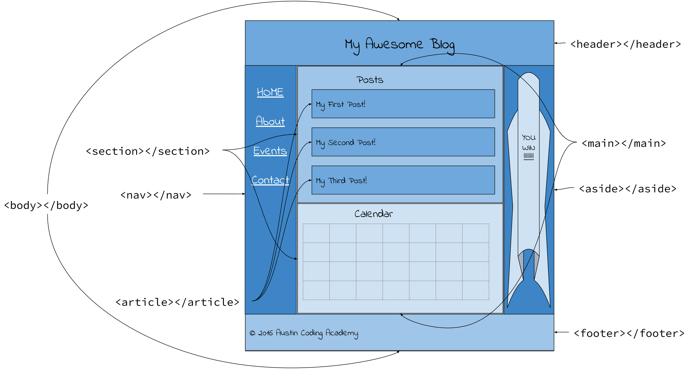



# Wireframing

*****

**Objective:** By the end of this lesson, the student will use a wireframe to structure their final project webpage.  

**Assignments:**
Practice Wireframe
Final Project Wireframe

*****

## Why is planning ahead important?

Before you start typing your first line of code, it will save you tons of time to have a set plan for what you want your webpage to look like.  The planning stage can alleviate stress because you have steps in your plan to follow and can manage your time.
Planning ahead can also improve the final product.  Taking time to plan ahead means that you do not have to make last minutes decisions on big parts of a project.  This can also save you from getting bogged down trying to figure out one piece of the plan.  

In what other ways can planning help you complete a project/assignment?

*****

### Before we code

We will need some additional resources for today's lesson.

* Pen/Pencil
  
* Paper

## What is a Wireframe?

Just like a blueprint for the construction of a house or building, **wireframes** are created to communicate the structure and functionality of a website or app. When a design, or **mockup** is given to you from your design team it will be your job to translate that mockup into code that is read by browsers of all sorts and shipped across the world. *Big stuff, right?*

A **wireframe** is, "an image, or set of images, which displays the functional elements of a website or page, typically used for planning a site's structure and functionality". In other words, a wireframe is the blueprint of a website. You'll be using the wireframe throughout this course. It's the plan for your codebase!!

  * Take a look at the wireframe below: 
  


  * What do you notice? What do you wonder?

### Constructing a Wireframe

Before beginning to wireframe, a designer would decide on the **objective** of their webpage. What idea are they trying to communicate? What do they want their user to do with it?

> "Website wireframes are 90% thinking/planning and just 10% drawing" - *Design and Function*

The wireframe is a visual guide that gives us a framework, or plan, on which to build our website. We use it to lay out a site's elements to best support our specific purpose or goal.

Some things a wireframe is <u>*NOT*</u>:

* A drawing of what your exact finished product will look like such as pictures, actual colors and fonts.
* A place to include filler text (use real text in the wireframe for clarity)
* An actual design (wireframes show how the site works, not how it will look)
* A place to do a rush job (you should label and describe every element of each page to avoid any misunderstandings)

*****

### See It

The wireframe below shows a basic blog page.  We identify the sections, and translate that into the HTML elements that would represent each piece.

 

Translating this into code becomes easier because we just follow the wireframe.

```html
<body>
  <header><h1>My Awesome Blog!</h1></header>
  <nav>Home<br>About<br>Events<br>Contact</nav>
  <main>
    <section>
      <h1>Posts</h1>
      <article>My First Post!</article>
      <article>My Second Post!</article>
      <article>My Third Post!</article>
    </section>
    <section>
      <h1>Calendar</h1>
      <table>...</table>
    </section>
  </main>
  <aside>You Win!!!</aside>
  <footer>© 2016 Austin Coding Academy</footer>
</body>
```

##### Explanations of the elements in the code:

* The [`<header>`](https://developer.mozilla.org/en-US/docs/Web/HTML/Element/header) element represents a group of introductory or navigational aids. It may contain some heading elements but also other elements like a logo, wrapped section's header, a search form, and so on.
<br>

* A [`<nav>`](https://developer.mozilla.org/en-US/docs/Web/HTML/Element/nav) element (HTML Navigation Element) represents a section of a page that links to other pages or to parts within the page: a section with navigation links. This is sometimes contained in the header.
<br>

* The [`<main>`](https://developer.mozilla.org/en-US/docs/Web/HTML/Element/main) element represents the main content of the `<body>` of a document or application. The main content area consists of content that is directly related to, or expands upon the central topic of a document or the central functionality of an application.
<br>

* A [`<section>`](https://developer.mozilla.org/en-US/docs/Web/HTML/Element/section) element represents a generic section of a document, i.e., a thematic grouping of content, typically with a heading. Each `<section>` should be identified, typically by including a heading (`<h1>`-`<h6>` element) as a child of the `<section>` element.
<br>

* The [`<article>`](https://developer.mozilla.org/en-US/docs/Web/HTML/Element/article) element represents a self-contained composition in a document, page, application, or site, which is intended to be independently distributable or reusable.
<br>

* The [`<aside>`](https://developer.mozilla.org/en-US/docs/Web/HTML/Element/aside) element represents a section of the page with content indirectly related to the page's main content, which could be considered separate from that content. These sections are often represented as sidebars or inserts.
<br>

* The [`<footer>`](https://developer.mozilla.org/en-US/docs/Web/HTML/Element/footer) element represents a footer. A footer typically contains information about the author of the section, copyright data or links to related documents.

*****

### Know Your Docs - Subject1

Use this link as a reference to help you with your assignment. [Wireframing 101](https://rbbideas.com/insights/wireframes-101-beginners-guide/). 

*****

### Practice It - Assignment

1. Find a website that appeals to you.
1. The company that owns this website now wants you to redesign their page.
1. Create a wireframe for the redesign.  
*Remember that wireframe should not have final colors/images
    * Label each section with its purpose.
    * Assign an HTML element to each piece in the wireframe. 

*****
*****

## Final Website Project

By the end of this course, you will have your own website that represents something important to you and/or a problem you want to solve.  Before you starting coding you need to develop a plan.

### Read It - Template Wireframe

We have provided a wireframe to guide you in building your webpage.  Remember the wireframe will help you build the structure of your webpage.  Study the wireframe and look at the structure that your website will have.

> To start with, we will stick to this template! If you want to challenge yourself, you can customize it later using some of our more advanced topics.  Stick with the structure we have given you for now.

******

### See It - [Figma Wireframe](https://www.figma.com/file/3sYpjzrB7zRV9dmHP7sW6r/my-site?node-id=0%3A1)

<iframe style="border: 1px solid rgba(0, 0, 0, 0.1);" width="100%" height="450" src="https://www.figma.com/embed?embed_host=share&url=https%3A%2F%2Fwww.figma.com%2Ffile%2F3sYpjzrB7zRV9dmHP7sW6r%2Fmy-site%3Fnode-id%3D0%253A1&chrome=DOCUMENTATION" allowfullscreen></iframe>

******

### Practice It - [Final Website Project](https://codesandbox.io/s/l2c-course-student-template-w8ojh?fontsize=14&hidenavigation=1&theme=dark)

Now that you have taken a look at the wireframe.  Let's start developing your website ideas.

1. Go to the Template [CodeSandbox](https://codesandbox.io/s/l2c-course-student-template-w8ojh?fontsize=14&hidenavigation=1&theme=dark)
1. Fork a copy and rename the Project "YOURNAME_FinalProject"
1. Find the 'Brainstorm' file
1. Then answer the questions in this file.  These questions will help you determine the objective of your website.  
1. Next, use the wireframe to build the HTML elements.
This goes in the 'index.html' file.

*****

## Questions for Class Discussion

1. What is a wireframe supposed to represent?
1. Why is wireframing important?
1. What should you include in a wireframe?
1. What should not be included into a wireframe?
1. How is the head element different from the header element?

*****

### Terminology to Know

* Wireframe
* Mockup
* elements

*****


