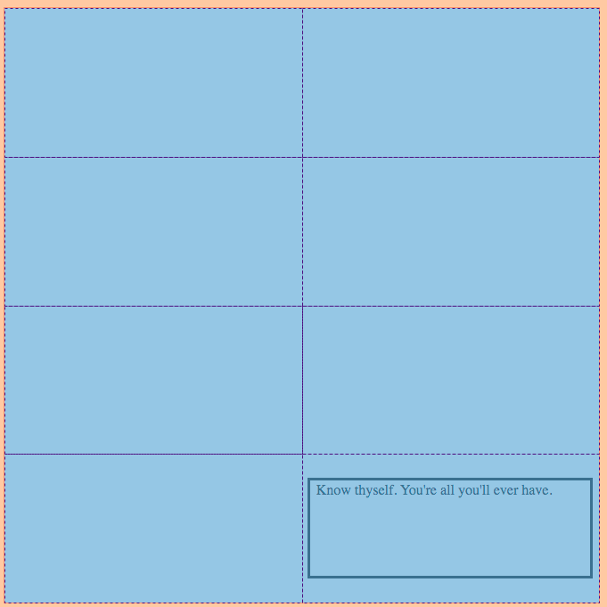
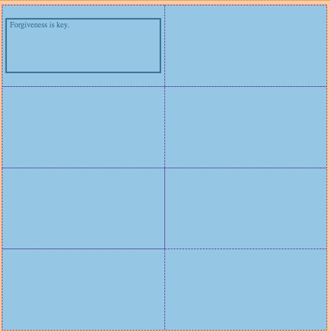



# CSS Grid

*****

**Objective:** By the end of this lesson, the student will investigate the attributes of CSS Grid and use CSS Grid to build the layout of their webpage.  

**Assignment:** Grid Puzzle CodeSandbox

*****

### Overview

#### The Display Element

The `display` property is actually quite powerful and a frequently used property because it controls how an element is displayed and even *if* an element should be displayed.

For now, it's good enough for you to know that with **Block Elements** like, `<h1-6>, <p>, <article>, <section>, <footer>, <main>, <form>`, etc... all have their `display` property set to `block` whereas **In-line Elements** like `<a>, <span>,`, etc... all have their `display` property set to `inline`. *See the connections?*

After playing with Box Model and Tables, you're probably wondering how you get elements to move over to the right instead of just stacking below one another as they do in **Normal Document Flow**. Well, this is how...CSS Grid.

[Grids are used all over the place](https://www.smashingmagazine.com/2017/12/building-better-ui-designs-layout-grids/): spreadsheets, shelves, cities, and even art paintings. If you've ever thought about the way newspapers, books, magazines, or in-general: **print work** is laid out, they use a grid to structure composition. Over time, the grid was brought over to the web because again, our whole society shifted from print to digital media.

When we begin building a website, laying out the overall structure is the first thing we do.  We learned about this when we covered Wireframing.

[CSS Grid](https://gridbyexample.com/what/) is a property in CSS we can assign to the `display` property of an HTML element to lay out our page in a specific way. Once we've applied the `grid` value to the `display` property, you can then use columns and rows to layout the Child Element within the selected Parent Element. This is a really useful way to lay out your page quickly and sustainably.

*****

## CSS Grid

To set an area of your webpage as a grid to layout out other elements on, just give the **Parent Element** the property & value: `display: grid;`. Let's say we want our `<body/>` element to contain a grid, simply select the `body` in your CSS file and set the property `display` to `grid` like so:

```css
body {
  display: grid;
}
```

*Easy. Right?*

>From here on, we'll refer to our `body` element as our **Grid Container**. You will need one of these **Parent Grid Containers** every time you would like to arrange elements, or **Grid Items**.

After that you'll need to set up the number of columns, `grid-template-columns`, and rows, `grid-template-rows`, you desire in the Grid Container. Let's say we want our `body` to have **2** equally sized columns and **4** equally sized rows:

| CSS         |
| ----------- |

```css
body {
  display: grid;
  grid-template-columns: 50% 50%;
  grid-template-rows: 25% 25% 25% 25%;
}
```

See how we assigned multiple values to `grid-template-columns` and `grid-template-rows`. The number of values we assign equals the number of columns or rows and the percentage represent how much space they'll take up.

> ***NOTE:** Make sure your percentages add up to 100%.*

Now our `body` element will have a grid with two columns that are 50% of the display wide and 4 rows that are each 25% of the total display's height.

Now we can place our Grid Items inside the Grid Container. Lets say we want our HTML element, maybe a `<section>` element, with the class name: `our-grid-item`, to be positioned at the bottom-right corner of our grid (*in the last row of the right column*). Take a look at the HTML and CSS snippets below and then the resulting screenshots the follows.

```html
<!-- index.html file -->

<body>
  <section class="our-grid-item">Know thyself. You're all you'll ever have.</section>
</body>

```

```css
/* style.css file */

body {
  display: grid;
  grid-template-columns: 50% 50%;
  grid-template-rows: 25% 25% 25% 25%;
/* Add some dimension and color for us to see it better */
  width: 500pt;
  height: 500pt;
  border: solid red 1pt;
}

.our-grid-item {
  grid-column: 2/3;
  grid-row: 4/5;
/* add color and dimension to see more easily */
  border: solid black 2pt;
  margin: 20pt 5pt;
  padding: 2pt 5pt;
}
```  


We specify the grid-lines we want the element to start & end on to tell the browser where to place the element on the grid!

We use the property `grid-column` on the **Grid Item**. This tells the browser to find the line in the grid you specified on the left-side of the `/` and end on the line number you gave on the right-side. The screenshot below shows what our Grid would look like with the gridlines...



*****

Here's another example, but now our element will be in the top-left of our document (top-row of the left-column).

```css
.our-grid-item {
  grid-column: 1/2;
  grid-row: 1/2;
}
```



*****

### More Grid Properties

When we use `grid` we have a load more properties that we get to use to make out layout match our Wireframe. We'll cover many of them here but be sure to checkout the **Know Your Docs** section to see more, get your short-hand code (*if you like*), and reference all the properties available with `grid`.

#### Grid Gaps

Between each of the Grid Items are gutters or gaps. You can adjust the size of these Gaps with the following properties: `grid-column-gap` and `grid-row-gap`

```css
.grid-container-element {
  display: grid;
  grid-column-gap: 8pt;
  grid-row-gap: 2pt;
}
```

#### Justify-Content & Align

Additional properties with `grid` that will allow you to adjust the space around and between elements either vertically or horizontally:

```css
.grid-container-element {
  display: grid;

  /* position on the x-axis */
  justify-content: space-evenly;

  /* position on the y-axis */
  align: center;
}

/* You can also use: space-between, space-around, start, end, and center */
```

#### FR

So far we've given our rows and columns percentages of the display. But as you work with other people's code you'll likely come across `fr` a unit of fractions. It stands for a fraction of the total available space.

In the snippet below we have 4 equally sized columns. They are laid out the same way as we saw earlier by giving 4 values to the `grid-template-column` property. But instead of `%` we'll use `fr`.

```css
.our-parent-container {
  display: grid;
  grid-template-columns: 1fr 1fr 1fr 1fr;
}
```

In the next snippet we'll see 4 columns again but now the two on the left will be half the width and the one on the right will be twice the width:

```css
.our-parent-container {
  display: grid;
  grid-template-columns: .5fr .5fr 1fr 2fr;
}
```

When using `fr`s, it's important to make sure the numbers add up to  the number of columns just the same way we make sure that our percentages total 100. So if we have 5 columns, our `fr`s need to add up to 5, i.e. `1fr 1.5fr 2fr .5fr` or `.5fr .5fr 2fr 2fr`, etc. You can use different combinations based on what you need your grid to look like.

*****

#### Push Yourself Further - The Short-Hands

We won't cover these in detail because you don't necessarily need them right away but just incase you want to advance your skills let's make you aware of them:

* `grid-area` property can be used as a shorthand property for the `grid-row-start`, `grid-column-start`, `grid-row-end` and the `grid-column-end` properties.
* `grid-template-areas` [take values of elements with the Parent Container and arrange them depending on their order](https://www.w3schools.com/cssref/pr_grid-template-areas.asp).

*****

## Building Grid with Online Tools

The following resources will give you the code for your Grid elements.  You still need to understand the properties of CSS Grid to be able to generate what your website needs.  

* [Layoutit!](https://grid.layoutit.com/)
* [CSS Grid Generator](https://cssgrid-generator.netlify.app/)

*****

### Know Your Docs

There are plenty of properties to CSS Grid. Read up on them at these highly recommended websites:

* [W3S-Grid](https://www.w3schools.com/css/css_grid.asp)
* [W3S-Grid Container](https://www.w3schools.com/css/css_grid_container.asp)
* [W3S-Grid Item](https://www.w3schools.com/css/css_grid_item.asp)
* [CSS Grid Tricks](https://css-tricks.com/snippets/css/complete-guide-grid/)

### Suggested Reading & Viewing on CSS Grid

* [Easy Layout w/ CSS Grid](https://www.youtube.com/embed/tFKrK4eAiUQ)
* [Intro to FR Units](https://css-tricks.com/introduction-fr-css-unit/)
* [Grid Areas](https://alligator.io/css/css-grid-layout-grid-areas/)
* [Best Practices with Grid](https://www.smashingmagazine.com/2018/04/best-practices-grid-layout/)

******

## Practice It - CSS Grid

1. [fr & CSS Gap CodeSandbox](https://codesandbox.io/s/white-hooks-20cw0?fontsize=14&hidenavigation=1&theme=dark)
    * Fork the CodePen,
    * In the CSS file, change the values on line 4 but be sure to maintain the total value of the number of columns,
    * On line 11, change the width of the gaps.
1. **MUST DO!** the [CSS Grid Garden](http://cssgridgarden.com/)
    * Play CSS Garden while learning CSS Grid.
    <br>

    <iframe
     src="http://cssgridgarden.com/"
     style="width:100%; height:500px; border:0; border-radius: 4px; overflow:hidden;"
     title="Grid Garden"
     >
     </iframe>

1. **MUST DO!** [Grid Puzzle](https://codesandbox.io/s/css-grid-puzzle-3qem6?fontsize=14&hidenavigation=1&theme=dark) Your goal is to make the top Grid look like the solution Grid.
    * Remember to **Fork**.
    <br>
    <iframe
     src="https://codesandbox.io/embed/css-grid-puzzle-3qem6?fontsize=14&hidenavigation=1&theme=dark"
     style="width:100%; height:500px; border:0; border-radius: 4px; overflow:hidden;"
     title="CSS Grid Puzzle"
     allow="accelerometer; ambient-light-sensor; camera; encrypted-media; geolocation; gyroscope; hid; microphone; midi; payment; usb; vr; xr-spatial-tracking"
     sandbox="allow-autoplay allow-forms allow-modals allow-popups allow-presentation allow-same-origin allow-scripts"
   ></iframe>

*****

### Terms To Know

* Grid
* Display
* Parent Element
* Grid-container
* Grid-Item
* `fr`
* `grid-template-columns`
* `grid-template-rows`

*****

### Questions for Student Discussion

1. Explain, aloud to someone that doesn't know programming, how to use CSS Grid.
1. How do you use the box model and css grid together?

1. What are the properties we need to know and remember when working with CSS Grid?

Push yourself further:
    1. Why would one choose to use `grid-template-area`?

*****

### Let's go to the next Lesson [Flexbox >](Flexbox.md)



<!-- ## Inner and Outer

****************** Box Model Content *****************

You can think of an element's dimensional properties in terms of two conceptual 'blocks':

1. **Content Block** - an element's *inherent* dimensional properties which contain `width` / `height`, `padding` and `border`.

1. **Containing Block** is the cumulative (inner + outer) Content Block dimensions combined with `margin`. This represents the amount of space an element occupies in a given layout.

Let's say you have 4 elements lined up in a row, and each element has a `width` of 25% (of it's parent container). If you give even one element a `border` of just **1px** on either side, it will mess up the layout - the elements will break down onto the next line of the page. This is because you've effectively given that element a **total width** of 25% **plus** the single pixel added by the new border.

> In scenarios such as this, a useful alternative to `border` is [`outline`](https://www.w3schools.com/css/css_outline.asp), which doesn't outwardly affect the element's `width` or `height`.

### See It

Using the Developer Tools (right-click/ctrl + click your browser and choose 'inspect') you can see the computed values of any element - conveniently represented in terms of the box model! -->

