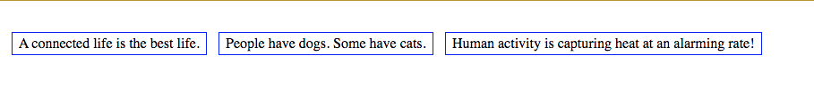



# Flex

*****

**Objective:** By the end of this lesson, the student will investigate the attributes of Flexbox and use Flexbox to build the layout of their webpage.  

**Assignment:** 
DemoFlexbox1 CodeSandbox
Giphy Gallery CodeSandbox

*****

### Overview

As you know, typical websites have multiple elements across the screen and not just stacked on top of one another. This can be done with the value: `flex` given to the property `display` of the element we want. Let's dig into that.

Remember that each of our elements in and HTML file have many properties behind them that we can access with CSS.  One of these properties is the `display` property. Through it we can change the way the element is rendered on the screen and how its **Child Elements** are arranged within it.

If you can't remember what *[Normal Document Flow](https://developer.mozilla.org/en-US/docs/Learn/CSS/CSS_layout/Normal_Flow)* is, review and talk with yourself for a moment.

*****

### display: flex;

```css
.my-parent-element {
  display: flex;
  /* other rules go here */
}
```

`flex`, is a value that can be given to the `display` property on any element that would normally contain other elements i.e. `section`, `article`, `footer`, `header`, `nav`. When added to an element, it gives us control of how child elements inside that element will be rendered. Take a look at the code snippets below and then checkout the following screenshot below to see if you can figure out how the `flex` value on the property `display` works before reading on.

| HTML         |
| ----------- |
```html
<!-- this section is the Parent Element -->
<section class="truthful-statements">
  <!-- Each of these article element are Child Elements -->
  <article>A connected life is the best life.</article>
  <article>People have dogs. Some have cats.</article>
  <article>Human activity is capturing heat at an alarming rate!</article>
</section>
```

| CSS         |
| ----------- |
```css
.truthful-statements {
  display: flex;
}

article {
  border-color: blue;
  border-style: solid;
  border-width: 1pt;
  margin: 20pt 5pt;
  padding: 2pt 5pt;
}
```
This looks like the image below when the browser reads it.  


The `flex` value allows us to flexibly display **Child Elements** within a **Parent Element**. Unlike the `inline` and `block` values, `flex` doesn't do anything in the way the Parent Element is displayed in relation to its **Sibling Elements**. `flex` only changes the way Child Elements are rendered inside of it.

When we add `flex` to an element it comes with some other properties that can be tweaked including these properties and their potential values:

* [`flex-direction`](https://giphy.com/embed/3d2OJh9B0XY7m) - values include: `row`(*the default*), `column` & `column-reverse`
* `flex-wrap` - `wrap`(*default*), `no-wrap`, `wrap-reverse`
* [`justify-content`](https://giphy.com/embed/6801TXpfwTmz6) - `flex-start`(*default*), `center`, `end`, `space-between`, `space-evenly`, `stretch`
* [`align-items`](https://media.giphy.com/media/RMhlpLOTZzlwk/giphy.gif) - `stretch`(*default*), `flex-start`, `center`, `baseline`, `flex-end`
* `align-content` - `stretch`(*default*), `center`, `flex-end`, `space-around`, `space-between`

> *NOTE: If you like using Short-Hand Code you'll enjoy: `flex-flow` = `flex-direction` & `flex-wrap`*

#### Know Your Docs

* [Hands-Down, the best Flex Handbook there is!](https://css-tricks.com/snippets/css/a-guide-to-flexbox/)
* [CSS Flex](https://www.w3schools.com/css/css3_flexbox.asp) *formally known as Flexbox.

#### Suggested Viewing

* [Academind - on CSS Flex](https://www.youtube.com/embed/RSIclWvNTdQ)
* [Animated CSS Tutorial](https://medium.com/@js_tut/flexbox-the-animated-tutorial-8075cbe4c1b2)
* [Difference btw Grid and Flex](https://www.youtube.com/embed/hs3piaN4b5I)

*****

### See It

1. Go to [FlexBox Froggy](https://flexboxfroggy.com/) and work through each of the challenges. 
    * Use the descriptions in each panel to find out more about the properties. 

1. [Flex Visualization](https://codepen.io/austincoding/full/XgKpxP/)
    * This is a tool for you to explore each property.
    * [How It Works](https://player.vimeo.com/video/296474019)

1. Fork the [DemoFlexbox1 CodeSandbox](https://codesandbox.io/s/cool-sun-0ntt5?fontsize=14&hidenavigation=1&theme=dark)
    * Go to the `Instructions.md` file to find the instructions.

******

## Flex-Item Properties

Now that you have a fair understanding of the way `flex` works on the Parent Element or **Container** and the results it has on it's Child Elements or **Items** let's look at the properties available to us to manipulate the **Items** within the `flex`ed display container.

Once you've assigned the value `flex` to the property `display` on an element, any element that goes inside of it now has the properties you see below. This is because of the way the computer stores information. As you add a property to one element the element(s) inside of it **Inherit** the same properties. This is why developers created the **Document Object Model**, so we can navigate all of these many properties inherited by one from the other.

### The Flex-Item Properties

* `order` - specifies the order of the flex items. You can tell the 3rd item to be the 1st item to be displayed.
* `flex-grow` - specifies how much a flex item will grow relative to the rest of the flex items. Items can be bigger than others.
* `flex-shrink` - how much a flex item will shrink relative to the rest of the flex items. They can also be smaller!
* [`flex-basis`](https://media.giphy.com/media/lYGkHJmOpTlgQ/giphy.gif) - specifies the initial length of a flex item. Add as much as you like.
* [`align-self`](https://media.giphy.com/media/Pug7CL2GhwSCA/giphy.gif) - specifies the alignment for the selected item inside the flexible container and overrides the `align-items` of the Parent Container.

> *NOTE: Again, if you like short-hand, the `flex` **property** combines `flex-grow`, `flex-shrink`, and `flex-basis` into one.*

#### Know Your Docs - Flex Items

Again, I cannot over-emphasize this, [read your docs](https://www.w3schools.com/css/css3_flexbox.asp)! This is a crucial tool you will use throughout your career and learning to work through them now is vital to your success.

* [W3S - Flex](https://www.w3schools.com/css/css3_flexbox.asp)
* [MDN - Flex](https://developer.mozilla.org/en-US/docs/Learn/CSS/CSS_layout/Flexbox)

#### Practice It - Flex Items

1. Fork the [FlexboxGiphy CodeSandbox](https://codesandbox.io/s/flexboxgiphygallery-5j43r?fontsize=14&hidenavigation=1&theme=dark).

    <iframe
     src="https://codesandbox.io/embed/flexboxgiphygallery-5j43r?fontsize=14&hidenavigation=1&theme=dark"
     style="width:100%; height:500px; border:0; border-radius: 4px; overflow:hidden;"
     title="FlexboxGiphyGallery"
     allow="accelerometer; ambient-light-sensor; camera; encrypted-media; geolocation; gyroscope; hid; microphone; midi; payment; usb; vr; xr-spatial-tracking"
     sandbox="allow-autoplay allow-forms allow-modals allow-popups allow-presentation allow-same-origin allow-scripts"
   ></iframe>

1. Look for the commented lines in the HTML for the instructions in the CodeSandbox.

    1. Now create a CSS rule for `gallery-two` on line 25 in the CSS file, to make it flexible and add *properties* you practiced.

            ```css
                .gallery-two {
                    display: flex;
                }
            ```

    1. Do that again for the third row: `row gallery-three`.
    1. Once you have at least 9 total images look at the ones you've added and compare them to three you started with in the first row: `row portrait-gallery`. What's different? Why?
    1. Can you make them match?
    1. Change the `order` of your gifs.
    1. Can you `-grow` or `-shrink` your gifs?

*****

## Building Flex with Online Tools

The following resources will give you the code for your Flex elements.  You still need to understand the properties of Flexbox to be able to generate what your website needs.  

* [MyCSSBuilder](https://www.mycssbuilder.com/)
* [Loading.io Flexbox Generator](https://loading.io/flexbox/)
* [Flexy Boxes](https://the-echoplex.net/flexyboxes/?fixed-height=on&display=flex&flex-direction=column&flex-wrap=wrap&justify-content=flex-end&align-items=flex-start&align-content=stretch&order%5B%5D=0&flex-grow%5B%5D=0&flex-shrink%5B%5D=1&flex-basis%5B%5D=auto&align-self%5B%5D=auto&order%5B%5D=0&flex-grow%5B%5D=0&flex-shrink%5B%5D=1&flex-basis%5B%5D=auto&align-self%5B%5D=auto&order%5B%5D=0&flex-grow%5B%5D=0&flex-shrink%5B%5D=1&flex-basis%5B%5D=auto&align-self%5B%5D=auto)

*****

### Terms To Know

* Container vs Item
* Child Element
* Parent Element
* Sibling Element
* DOM
* Inherit
* Normal Document Flow
* In-line Elements
* Block Elements
* `display` property
* `flex` property
* `flex` value

*****

### Questions for Student Discussion

**If you don't know the answers to any of these questions,Remember S.A.T.**

1. What advantages does flex provide?
1. Which flex properties do you think you will use the most? Why?
1. Explain some of the key flex properties along with their functionality.
1. Describe a use case for `order` on a flex item.
1. When would you use flex box and when would you use grid?

*****

