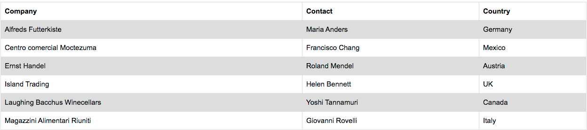
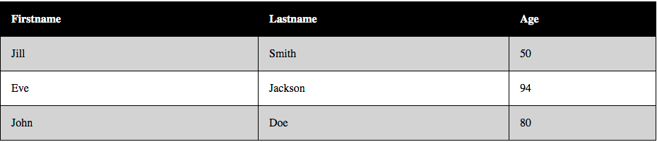



# HTML Tables

*****

**Objective:** By the end of this lesson, the student will use HTML Table elements to build an HTML table.  

**Assignment:** Mario and Luigi with HTML Tables

*****

## Overview Table Elements & `:nth-child()`

Before the days of `grid` and `flex` many developers used `<table>` to position elements on a "grid-like" structure. It was very hacky but it got the job done. Today, `<table>` isn't used as often but it is still a viable way to structure pieces of our page especially if we need to represent something in a table chart. We'll learn to use the `<table>` element and its dedicated child elements as we build our Luigi Character!!

### What Are HTML Tables

But first, what is an HTML Table? Well, it looks a lot like a spreadsheet:



And the code looks like this:

```html
<table>
  <thead>
    <th>Company</th>
    <th>Contact</th>
    <th>Country</th>
  </thead>
  <tbody>
    <tr>
      <td>Alfreds Futterkiste</td>
      <td>Maria Anders</td>
      <td>Germany</td>
    </tr>
    <tr>
      <td>Centro comercial Moctezuma</td>
      <td>Francisco Chang</td>
      <td>Mexico</td>
    </tr>
    <tr>
      <td>Ernst Handel</td>
      <td>Roland Mendel</td>
      <td>Austria</td>
    </tr>
    <tr>
      <td>Island Trading</td>
      <td>Helen Bennett</td>
      <td>UK</td>
    </tr>
    <tr>
      <td>Laughing Bacchus Winecellars</td>
      <td>Yoshi Tannamuri</td>
      <td>Canada</td>
    </tr>
    <tr>
      <td>Magazzini Alimentari Riuniti</td>
      <td>Giovanni Rovelli</td>
      <td>Italy</td>
    </tr>
  </tbody>
  <tfoot>Notes about the companies would go here.</tfoot>  
</table>
```

### The Tags

So what's happening? Notice how there are HTML tags you haven't seen before. These elements are reserved for use **only** within the `<table></table>` element because the `<table>` element has properties reserved for those elements: `<td>`, `<tr>`, and `<th>`, so that each of them "snaps" into place when they're written inside the dedicated parent element, `<table>`.

Check it out: the `<tr>` element stands for **Table Row** which, as you guessed, creates a row in our tables.

The `<th>` element creates another table row but is actually called a **Table Header** because it labels the columns of our table.

The `<td>` element creates the columns within each row. This element is used within the `<tr></tr>` element.

Then, of course, there's `<thead>`, `<tbody>`, and `<tfoot>` which you might have guessed stand for **Table Head**, **Table Body**, and **Table Footer**. These elements are used as sort of a "*Title Row*", for the top of the table: `<thead>`, then the main part of table: `<tbody>`, and the footer of the table: `<tfoot>`. They are optional elements but very useful when creating an organized table.

#### Special Attributes of `<table>`

The child elements of `<table>`: `<tr>` and `<td>` have the same styling properties as the other elements you've learned about so far like `border`, `padding`, `text-align` and so forth. In addition to those typical properties we have the option to use the two attributes: `colspan` and `rowspan`.

The purpose of `colspan` is to tell an element how many column spaces to take up. This can be a way to format the layout of a table.  We might use `colspan` to create a header that covers multiple columns like: `<th colspan="2">Employee Name</th>` where the first column might be the employees first name and the second column could be their last name but we want them both to be label under on cell: "Employee Name". Essentially, it just makes that specific "*cell*" traverse or "span" the number of columns specified in the value.

The same goes for `rowspan`; it will tell the element how many row spaces to take up. When using this attribute, the cell will traverse multiple rows: `<tr rowspan="3">Top Three Earners:</tr>` could be a cell on the far left of your table that relates to the three rows to the right of it... as in, it spans the height of three rows!

#### New Pseudo Selector

The `:nth-child()` selector isn't specific to the `<table>` element but this is a nice place to learn about it because of the nature of a table chart: many rows and columns.

With the `:nth-child()` pseudo selector we can select a specific number(*n*) of child elements. Let's say in the `table` we want the rows to be easier to read by having differently shaded backgrounds. In the `()` of `:nth-child()` we can specify `odd` and `even` to apply the `background` color we want for any number of rows that might be present in the table.

    *The value of n just represents whatever number we need it to be.*

The following code snippets will produce the screenshot you see below them:

| HTML         |
| ------------- |

```html
<table>
  <tr>
    <th>Firstname</th>
    <th>Lastname</th>
    <th>Age</th>
  </tr>
  <tr>
    <td>Jill</td>
    <td>Smith</td>
    <td>50</td>
  </tr>
  <tr>
    <td>Eve</td>
    <td>Jackson</td>
    <td>94</td>
  </tr>
  <tr>
    <td>John</td>
    <td>Doe</td>
    <td>80</td>
  </tr>
</table>
```

|CSS      |
| ------------- |

```css
table tr:nth-child(even) {
  background-color: lightgrey;
}
table tr:nth-child(odd) {
 background-color: white;
}
table th {
  background-color: black;
  color: white;
}
```

|Result      |
| ------------- |


Notice how in the CSS  the `:nth-child()` is placed on the `tr` element which is the one we want to be colored? Then notice how it was placed after the parent element: `table`? If not, go back and look at how the CSS code is laid out. Try it yourself.

And lastly, don't be scared of this selector. `n` just stands for a number to be specified, `th` is just a stand-in suffix for the general numbers like `-nd`, `-rd`, and `-st` as in "2nd", "3rd", and "1st". But "th" is the most common so the developers of CSS decided on `th`. And `-child` just means its meant to be used on child elements, and with the exception of `<body>`, all elements are children of some other element.

*****

### Know Your Docs

As you already know, the best place to learn about everything web development - is in the docs! Here are the docs for:

* [HTML Tables](https://www.w3schools.com/html/html_tables.asp).
* [CSS :nth-Child() Selector](https://www.w3schools.com/cssref/sel_nth-child.asp)

*****

### Practice It

1. Rebuild the `:nth-child()` example from above in a new CodeSandbox.
    * Try changing the `n` value to see what happens.
1. Take a few minutes to explore the [Mario Tables](https://codesandbox.io/s/mario-html-tables-gghjy?fontsize=14&hidenavigation=1&theme=dark) CodeSandbox.  Look at how `colspan` and `rowspan` are being used.  
    * Remember to **Fork**!
    * Create [Luigi](https://cdn.pixabay.com/photo/2016/07/30/21/12/luigi-1558026__340.jpg) Using HTML Tables. Hint: Search for *'Pixelated Luigi'* for some help.
    * Challenge Yourself:
        * Make Luigi facing the opposite direction from Mario.
        * Change Luigi's position, maybe running.
        * Use `:nth-child()`
    >Hint: Get some grid paper and [Wireframe](../Unit01/Wireframing.md) out your Luigi Table.

*****

## Terms to Know

* `<table/>` Element
* `<th>`,`<tbody>`, `<tfoot>`
* `<tr>`
* `<td>`
* `rowspan`
* `colspan`
* `<caption>`
* `:nth-child()`

*****

## Questions for Student Discussion

1. What are the dedicated child elements of the table element?
1. What do we use a `<th>` element for?
1. What is the difference between `<tr>` and `<td>`?
1. What values can you pass into the `()` of the `:nth-child()` selector?
1. How would you describe the way the `:nth-child()` work to a 5 year old?

*****

### Let's go to the next Lesson [CSS Grid >](CSSGrid.md)

