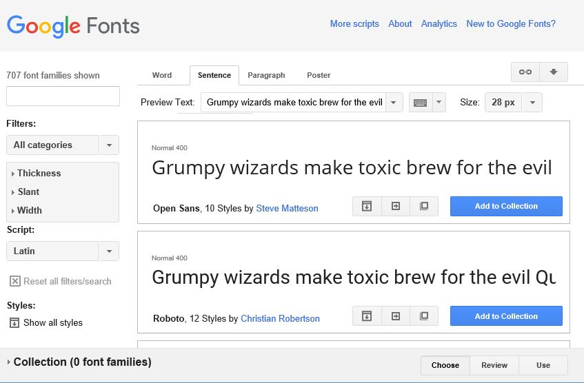
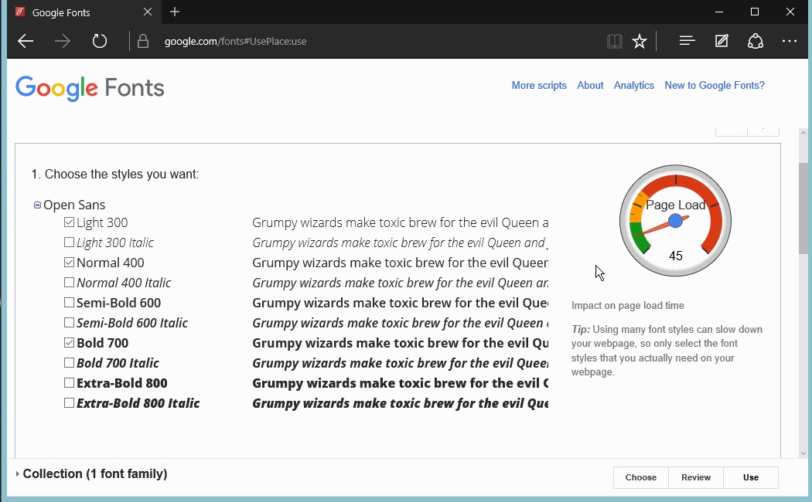



# Google Fonts

*****

**Objective:** By the end of this lesson, the student use transitions and transformations to add dynamic styles to a webpage.

**Assignment:** Boxes Animation Part 2

*****

## Exploring Google Fonts - [Google Fonts](https://fonts.google.com)

You have noticed that we don't have many options when it comes to select a font, we pretty much have the [CSS Web Safe Font](http://www.w3schools.com/cssref/css_websafe_fonts.asp) for us to work with and to be honest it is very limited. We can increase our font options used on a webpage using Google Fonts. Just visit [Google font](https://www.google.com/fonts) website and check all the available font they have in the library.



Once you have added to the collection the font you want to use, click on the `use` button at the bottom of the page to choose the style you want


> Dont go over yellow or red on the `Page Load-meter`. If you are adding too many styles there is something wrong with the design of the website.

Now, go down to step 3 and copy the link given to you.



That link you just copied goes on your HTML page. It needs to go before the CSS file is going to utilize that font.

```html
<!DOCTYPE html>
<html>
    <head>
        <title>Awesome website</title>
        <!-- Font from Google Fonts -->
        <link rel='stylesheet' href='https://fonts.googleapis.com/css?family=Open+Sans:400,300,700'>
        <!-- CSS file that is going to utiliza that font -->
        <link rel='stylesheet' href='css/my-style.css'>
    </head>
    <body>
        <!-- HTML Elements-->
    </body>
</html>
```

This is how you'd implement that font on your CSS file

```css

/* my-style.css */

body {
    font-family: 'Open Sans', sans-serif;
}

h3 {
    font-family: 'Open Sans', sans-serif;
    font-weight: 700;
}
```

```html
<!DOCTYPE html>
<html>
    <head>
        <title>Awesome website</title>
        <!-- Remove some style given by the user agent -->
        <link rel='stylesheet' href='css/css-reset.css'>
        <!-- CSS file that contains your style -->
        <link rel='stylesheet' href='css/my-style.css'>
    </head>
    <body>
        <!-- HTML Elements-->
    </body>
</html>
```
*****

### See It

* How to use Google Fonts:

<iframe width="560" height="315" src="https://www.youtube.com/embed/Z3JR6mEWEEo" frameborder="0" allow="accelerometer; autoplay; encrypted-media; gyroscope; picture-in-picture" allowfullscreen></iframe>

*****

### Practice It

* Choose a couple of fonts that you would like to use in your final project and add them to your Final Project.


*****


