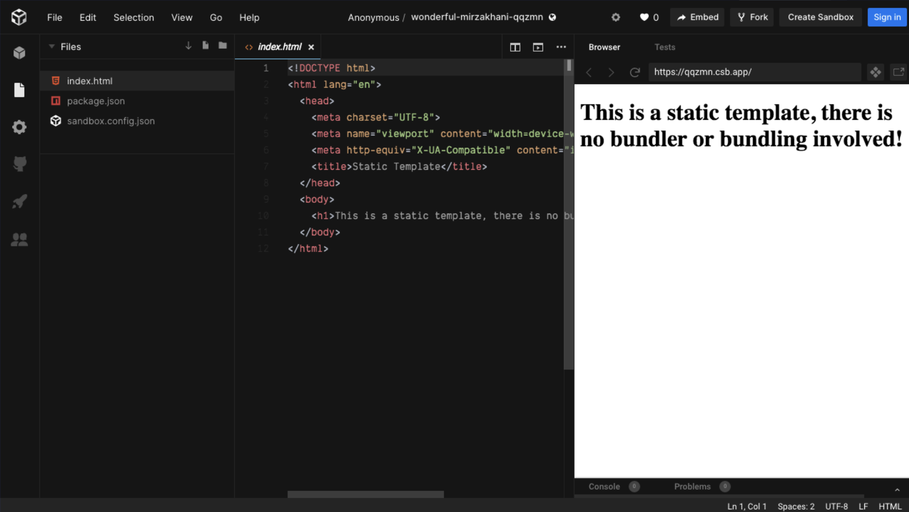
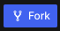



# Step 3 - Getting to know CodeSandbox.io
<!-- This is how each subject should be introduced. Give the students structure so they know they can start trusting the process sooner!  -->
If you have not signed up for an account, do it NOW! 
<iframe width="476" height="268" src="https://youtu.be/kCTadOM8GpM" frameborder="0" allow="autoplay; encrypted-media" allowfullscreen></iframe>

## Read and See It 
<!-- Give them our writing of the subject then link to a few articles: Medium, Wikipedia, CSS-Tricks, W3S, MozillaDev, etc... that help give more perspective on the subject  -->

CodeSandbox is where we will be coding our final Website Project.  This final project will be the biggest component of your portfolio that you will be building throughout this course.

### Follow these steps to open a Sandbox.

1. Go to [CodeSandbox.io](https://codesandbox.io)

1. Sign in your CodeSandbox account using your GitHub username and password.

1. Create a new static Sandbox: Click on   for a Static Sandbox

    

1. There are three main sections to a CodeSandbox project. 

    * File Explorer
        * The section on the far left lists all the files associated with the current project.  We will focus on adding content to the index.html.  
        
            Do <u>NOT</u> make changes in the package.json file.

    * Editor Window
        * The middle section is where you will actually edit code and write new code.  You can open and edit multiple files. Each file will open in a tab in the center section. 

    * Runtime Environment
        * The section on the far right shows what your code will actually look like on the browser.  
        * The url above this section is your webpage url.  You can give this url to anyone and they will see your hard work. 
            In the picture below the url is https:qqzmn.csb.app/

         

    ### The picture below shows these three sections:
        
    

## Practice It

 Throughout the class, you will be given links to different projects.  Make a copy by **Forking** the project.   

   

Forking makes a copy that is now yours and you can edit and make changes but it will not affect the original file.  

Fork the embedded project and explore the menus with your teacher.

<iframe src="https://codesandbox.io/s/l2c-course-student-template-w8ojh?fontsize=14" style="width:100%; height:500px; border:0; border-radius: 4px; overflow:hidden;" title="L2C-Course-Student-Template" allow="geolocation; microphone; camera; midi; vr; accelerometer; gyroscope; payment; ambient-light-sensor; encrypted-media; usb" sandbox="allow-modals allow-forms allow-popups allow-scripts allow-same-origin"></iframe>

*****

### Go to [S.A.T> Method >](splat-Prep.md)


