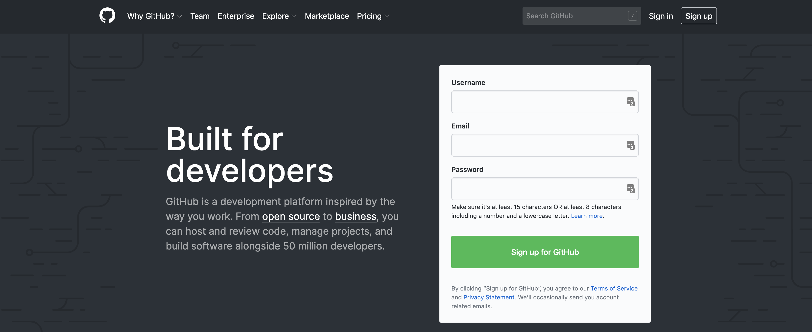



# Step 1 - Prepare Your Machine

1. Be sure to download [Chrome](https://www.google.com/chrome/) 

1. There is a difference between a text editor and an IDE.  

    * A text editor is just that, a text editor. It is used to edit and contain your code into files before they are executed. There are plenty text editors including Atom, SublimeText, IntelliJ, Brackets, WebStorm, VIM, TextWrangler, RubyMine and even NotePad++. 

    * An IDE is an Integrated Development Environment. This is the same as a text editor but does so many more tasks like auto-complete, bug watching, value assistance & integrating the text into a runtime environment like a web browser.

    **The IDE that we will be using is called _CodeSandbox_.**

1. Create a [Github](https://github.com/) account.
    * Go to the website [www.github.com](https://github.com/)
    * Sign-up for a github account using the email determined by your teacher.

    Use the image below as a reference:

    

### Go to [Pre-Work Step 2 >](codeSandboxes-Prep.md)


